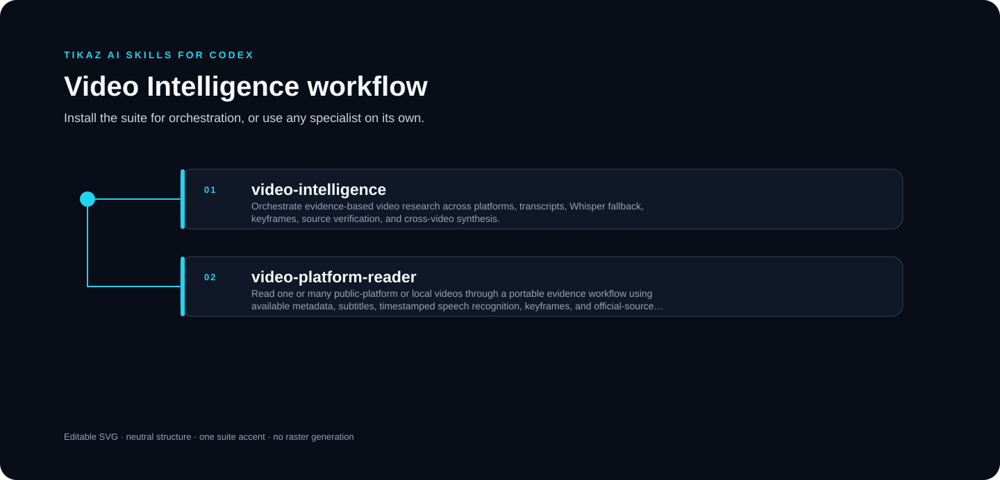

<p align="center"><a href="README.md">English</a> · <strong>简体中文</strong></p>

<p align="center"></p>

# TIKAZ Video Intelligence for Codex

**保留时间戳、关键帧、来源卡与证据等级的跨平台视频阅读工作流。**

由 **TIKAZ** 主导设计、整合、独立重构和持续维护。


<table data-proof-strip="true" width="100%">
<tr>
<td data-proof-cell="true" align="center" width="25%" title="从仅元数据阅读到第一手来源核验"><h3>5</h3><sub>证据等级</sub></td>
<td data-proof-cell="true" align="center" width="25%" title="字幕、视觉观察、外部核验与推断相互分离"><h3>4</h3><sub>分离的主张通道</sub></td>
<td data-proof-cell="true" align="center" width="25%" title="字幕、语音识别与任务相关关键帧"><h3>3</h3><sub>媒体证据通道</sub></td>
<td data-proof-cell="true" align="center" width="25%" title="主张保留时间锚点、证据等级、置信度与降级状态"><h3>1</h3><sub>带时间戳来源账本</sub></td>
</tr>
</table>

## ✨ 核心方法

- 把元数据、原生字幕、带时间戳 ASR、关键帧和官方来源核验分成五个证据等级。
- 把“来源主张、字幕证据、画面观察、外部核验和推断”分开记录。
- 每个视频先形成独立证据卡，再进行跨视频综合；无法访问和部分失败不会被静默丢弃。

## 🧩 可以单独使用的 Skill

| Skill | 角色 | 用途 |
|---|---|---|
| [`video-intelligence`](https://tikazi.github.io/TIKAZ-AI-Skills/zh/skills/video-intelligence/index.html) | 编排器 | 多视频证据整理、冲突比较与综合 |
| [`video-platform-reader`](https://tikazi.github.io/TIKAZ-AI-Skills/zh/skills/video-platform-reader/index.html) | 专业 Skill | 单独读取公开视频、播客或本地媒体并生成证据卡 |

## 🚀 示例

```text
使用 video-platform-reader 比较这几个 B 站和 YouTube 视频。
为关键结论保留时间戳，把字幕证据、画面观察和未核实主张分开。
```

## ⚠️ 限制

- 平台访问、字幕、下载、ASR 与视觉检查取决于当前地区、登录态、权限和工具。
- 标题、简介和搜索摘要不能当成已经观看的内容。
- 不绕过 DRM、登录、付费墙或平台访问控制。

来源与贡献边界见 [SOURCES.yml](SOURCES.yml) 与 [THIRD_PARTY_NOTICES.md](THIRD_PARTY_NOTICES.md)。

## 🌐 探索 TIKAZ 工作流家族

[🏠 AI Skills](https://github.com/TIKAZI/TIKAZ-AI-Skills) · [⚡ Context Economy](https://github.com/TIKAZI/TIKAZ-Codex-Context-Economy) · [🎨 Frontend Design](https://github.com/TIKAZI/TIKAZ-Codex-Frontend-Design) · [🎬 Video Intelligence](https://github.com/TIKAZI/TIKAZ-Codex-Video-Intelligence) · [🛠️ Engineering](https://github.com/TIKAZI/TIKAZ-Codex-Engineering) · [🔬 Research](https://github.com/TIKAZI/TIKAZ-Codex-Knowledge-Research) · [📽️ Presentation](https://github.com/TIKAZI/TIKAZ-Codex-Presentation) · [🖼️ Visual Content](https://github.com/TIKAZI/TIKAZ-Codex-Visual-Content)
